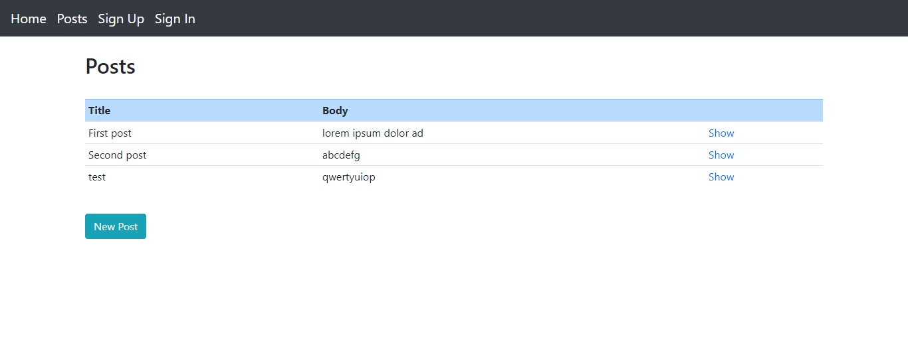

# [Twitter clone]

-  I built an exclusive clubhouse app where the members can write embarrassing posts about non-members. Inside the clubhouse, members can see who the author of a post is but, outside, they can only see the story and wonder who wrote it, using Ruby on Rails

- Models, Views, and Controllers (MVC)
- Data Structures & Relationships
- Routing
- Migrations
- Views with forms, partials, and helpers
- RESTful design
- Adding gems for extra features

## Screenshot

 
## Setup

- First install RUBY and Rails in your computer.
- For windows users you can go to [Ruby installer](https://rubyinstaller.org/).
- MAC and LINUX you can go to [Ruby official site](https://www.ruby-lang.org/en/downloads/) for intructions.
- Make a copy in your local enviroment(git clone https://github.com/mohamedSabry0/micro-reddit.git)
- Run the command (bundle install) in your terminal in the root folder of the project.
- Run the command (rails db:migrate) in your terminal in the root folder of the project.
- Run the command (rails server or rails s) in your terminal in the root folder of the project.

## Built With

- Ruby on Rails
- Rubocop
- Stylelint

## Prerequisites

- Ruby on Rails

## GitHub Repo

-  https://github.com/Rocio01/re-former

👤 **Rocio Martinez**

- Github: [@Rocio01](https://github.com/Rocio01)
- Twitter: [@rugiada8801](https://twitter.com/rugiada8801)
- Linkedin: [zulma-rocio-martinez](https://www.linkedin.com/in/zulma-rocio-martinez)

## Acknowledgments

- Microverse
- Ruby on Rails
- The Odin project

## Show your support

Give a ⭐️ if you like this project!

